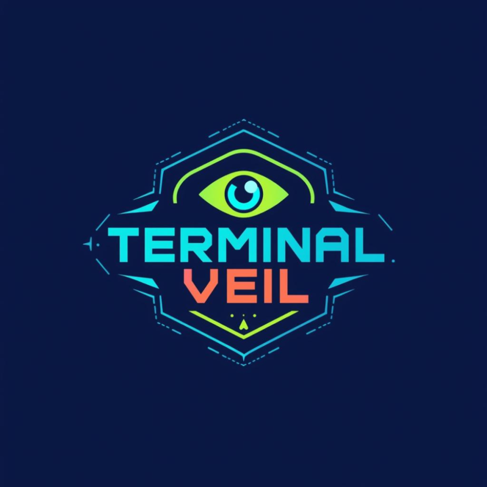

# Terminal Veil

Mixed-reality puzzle adventure game. Scan real-world objects (colors, shapes, QR codes) to solve puzzles and progress through 8 sectors.



## Screenshots

*Coming soon - see [docs/SCREENSHOTS_GUIDE.md](docs/SCREENSHOTS_GUIDE.md) for capture instructions*

<!-- Uncomment when screenshots are ready:


-->

## Quick Start

### Web Edition (Recommended)
Works on iPhone, Android, and Desktop:

```bash
cd ~/TerminalVeil
pip install flask opencv-python pyzbar numpy pillow
python app.py
```

Then open `http://YOUR_IP:5000` on any device.

### iOS Native Build
Requires macOS with Xcode:

```bash
# Clean and rebuild
cd ~/TerminalVeil
rm -rf build/
briefcase create ios
briefcase build ios
briefcase run ios
```

Note: iOS build uses simplified camera processing (no OpenCV/pyzbar).

## Project Structure

- `app.py` - Flask web server (works everywhere)
- `terminalveil/` - Game package
  - `terminal.py` - Game engine
  - `puzzles.py` - Level definitions (8 sectors)
  - `camera_handler.py` - Full OpenCV/pyzbar version
  - `ios_camera_handler.py` - iOS-compatible version
  - `save_manager.py` - Save/load system
- `templates/index.html` - Web UI
- `pyproject.toml` - Briefcase config for iOS
- `PRIVACY_POLICY.md` - Privacy policy for mobile apps

## Game Progression

1. **Calibration** - Scan anything
2. **Crimson Gate** - Find red object
3. **Encoded Transmission** - Scan QR with "VEIL-42"
4. **Geometric Lock** - Show circle
5. **Dual Authentication** - Blue + QR with "END"
6. **Commercial District** - Scan barcode
7. **Triangular Paradox** - Show triangle
8. **Final Veil** - Match random signature

## Publishing

### itch.io
See [itchio/itchio_page.md](itchio/itchio_page.md) for page content and [itchio/index.html](itchio/index.html) for a standalone promo page.

### Screenshots & Demo
See [docs/SCREENSHOTS_GUIDE.md](docs/SCREENSHOTS_GUIDE.md) for detailed instructions on capturing screenshots and creating demo GIFs.

## Privacy

See [PRIVACY_POLICY.md](PRIVACY_POLICY.md) for details on data collection (spoiler: we collect almost nothing).

## License

MIT License - see [LICENSE](LICENSE) for details.
